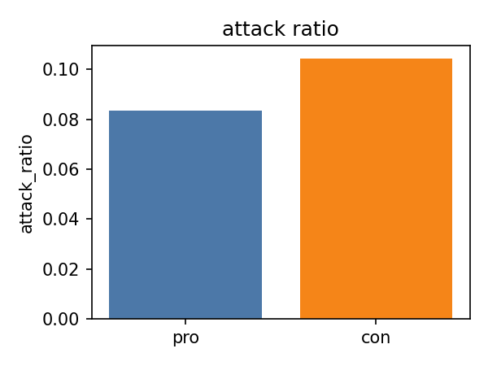
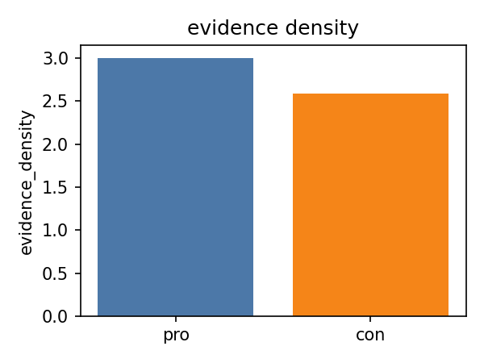
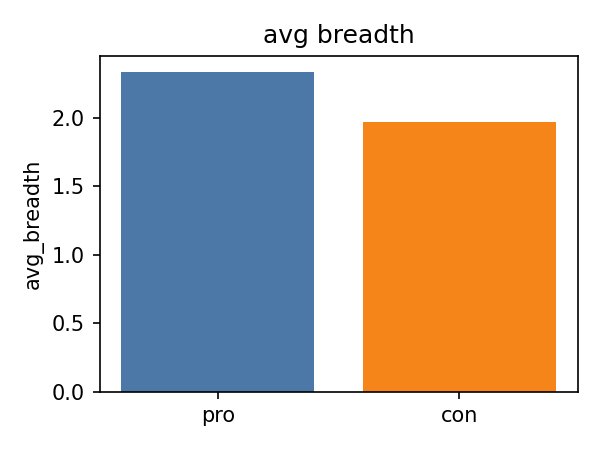

Literature Review: Argument Mining, Rhetorical Structure, and Stance-Conditioned Patterns

Argument mining seeks to automatically identify argumentative units—claims, premises—and the relations that connect them, such as support and attack, in natural language text (Lawrence & Reed, 2019). Foundational work established feasibility in constrained domains and task decompositions. In the legal domain, Mochales and Moens (2009, 2011) showed how to detect and structure argumentative sentences in court decisions, while Cabrio and Villata (2012) modeled agreement and contradiction between arguments using textual inference. These early systems typically treated subproblems in isolation (component detection, then relation classification) and were evaluated on modest, domain-specific corpora, but they clarified the representational commitments—component spans and labeled edges—that underpin contemporary approaches.

A central strand of research has targeted well-formed persuasive essays, where arguments are relatively canonical. Stab and Gurevych (2014, 2017) introduced a widely used corpus and annotation scheme for essays, with token-level spans for MajorClaim, Claim, and Premise, and explicit Support and Attack links. They demonstrated that identifying components as a sequence-labeling problem improves over sentence-level decisions, and that joint global inference via integer linear programming (ILP) enforces coherent structures that outperform pipeline baselines. In this genre, argument graphs typically resemble shallow trees centered on a main claim: premises provide first-order support or attack; multi-step support chains are possible but rare. The essay setting thus offers high-quality supervision and stable evaluation for both component detection and relation classification.

Beyond essays, the IBM Debater line of work extended argument mining to topic-centric retrieval at scale. Levy et al. (2014) formalized context-dependent claim detection: given a topic, retrieve concise claim statements that support or contest it. Their cascade—recall-oriented sentence filtering, boundary identification, and ranking—addressed extreme sparsity (≈2% of sentences contain a topic-relevant claim) and demonstrated feasibility of topic-conditioned mining. Rinott et al. (2015) complemented this with context-dependent evidence detection: identify sentences that support a given claim under a topic. Their pipeline combined candidate generation, verification, ranking, and evidence-type classification (e.g., study, expert testimony), producing robust top-ranked supports across topics. Together, these works operationalize breadth (many claim/evidence items per topic) and provide retrieval-oriented complements to in-document argument parsing.

Relation modeling and full-structure parsing have also advanced. Peldszus and Stede (2015) and subsequent graph- and transition-based approaches built argument structures by scoring global configurations rather than independent links, improving robustness to local errors. In dialogic and social media data, attacks become more salient: Cabrio and Villata (2012) model contradiction between user-generated arguments; Zhang et al. (2017) curate online discussion corpora to study support/attack networks; Park and Cardie (2018) analyze public comments (CDCP) with multiple claim–evidence groupings per post. These genres often produce wider, multi-claim structures, multiple disconnected components per document, and a higher proportion of counter-argumentation than essays. Quality assessment work (Wachsmuth et al., 2018) further connects structural and linguistic features to rhetorical dimensions such as clarity and sufficiency, motivating joint analysis of structure and quality.

Recent systems leverage transformer encoders to improve both component and relation performance. Span detection is framed as token/sequence tagging; relations are cast as pairwise text classification (support/attack/none), sometimes augmented with constraints to maintain structural validity. Such models capture long-range dependencies and subtle rhetorical cues that elude feature-based approaches, often yielding substantial F1 gains for components and modest but consistent improvements for relations. A parallel trend treats argument mining as holistic generation or structured prediction, predicting full graphs in a single pass, though standard benchmarks still commonly evaluate the component-plus-relations decomposition.

Key Point Analysis and Quality Labels. The ArgKP-2021 dataset (Friedman et al., 2021, overview) instantiates a related but distinct task: linking arguments to concise key points under a topic and stance. The binary match label indicates whether an argument instantiates a key point; although this is not an explicit support edge within a single document, it can serve as a proxy for support in topic-centered collections. The IBM ArgQ-30k dataset (Gretz et al., 2020) provides stance and crowd-aggregated quality labels for individual arguments, enabling analyses that connect structure proxies to perceived quality. These resources extend beyond the essay setting and permit stance-aware and topic-aware analyses at scale, albeit with fewer gold structural annotations.

Gap: Stance-Conditioned Structure. While stance detection and argument mining have progressed substantially, comparatively little work explicitly examines how stance shapes argumentative structure within the same topic. Essays, debates, and comments can be compared on component distributions, the prevalence of attack versus support, and graph-theoretic properties (depth, breadth, density). Yet few studies have systematically contrasted the structural signatures of pro and con positions controlling for topic. This gap matters for both theory and practice: debate pedagogy, argument generation, and quality assessment all benefit from understanding whether and how different sides marshal evidence and counter-arguments differently.

Alignment with the Present Study. We position our work at this intersection: leveraging gold-annotated essay data to compute reliable structural metrics and then testing stance-conditioned hypotheses; and using large-scale resources (ArgKP, ArgQ) to extend coverage via proxies and stance-partitioned summaries. On essays, we adopt established best practices: span detection as token-level tagging and relation classification as pairwise prediction, with light constraints where applicable. Importantly, our computation of breadth and depth is aligned with annotation semantics: in BRAT, support edges are directed from premises to claims; hence breadth is defined as the number of incoming supports per claim, and depth as the longest chain of incoming supports ending at a (major) claim. This avoids artifacts from misoriented edges and yields interpretable measures. For ArgKP, we treat argument–key point matches as support proxies and compute stance-partitioned breadth and density at the topic/key-point level. For ArgQ, we plan to derive structural proxies via an essay-trained component detector and test their association with quality while controlling for confounds such as length.

Our hypotheses reflect patterns suggested by the literature and the genres under study. Pro positions, especially in essay-like expository writing, are expected to emphasize constructive support—denser evidence and broader parallel reasons—while con positions, particularly in adversarial settings, are predicted to allocate more structure to refutation, increasing the attack ratio. Depth differences are expected to be modest in essays due to genre conventions (single-step supports dominate), but may vary in other domains. Preliminary measurements on essays using conservative stance labels are consistent with these expectations: pro exhibits higher evidence density and breadth; con shows a higher proportion of attacks; depth remains similar across sides. These early signals, obtained without learned models, argue for the plausibility of stance-conditioned structural differences and motivate fuller model-based analyses.

Methodological Implications. The literature underscores several design choices we adopt. First, span-level modeling is critical when component boundaries matter (Stab & Gurevych, 2017); we therefore favor token/sequence tagging for components in the gold-annotated corpus. Second, relation classification benefits from pairwise encodings that capture cross-sentence semantics; we deploy transformer cross-encoders and consider lightweight constraints or post-hoc global inference for graph coherence. Third, when moving to datasets without gold structures (ArgKP, ArgQ, CMV), explicit labeling gaps must be bridged with proxies and careful validation. Prior topic-dependent retrieval work (Levy et al., 2014; Rinott et al., 2015) suggests that high-recall filtering followed by precise verification and ranking is a practical pattern; our proxy pipelines follow this spirit, with manual sanity checks to bound noise.

Evaluation and Reporting Norms. Following precedent, we evaluate component spans by P/R/F1 (both exact and partial), relations by macro-F1 across support/attack/none, and report graph-level statistics with effect sizes and confidence intervals. Stance-conditioned comparisons are paired within topic where possible to reduce confounds. For proxy-based analyses, we disclose the proxy definitions and include small-sample human validation to quantify precision. We present compact tables per dataset and a small number of plots that foreground theoretically salient differences (e.g., attack ratio and evidence density by stance in essays, breadth proxies by stance in topic-keypoint collections).

Outlook. The trajectory from feature-based pipelines toward transformer-based and structure-aware models has materially improved argument mining across genres. Retrieval-oriented corpora (context-dependent claims and evidence), key point analysis, and quality-labeled collections provide complementary views of argumentative content at scale. The open methodological question addressed here—how stance conditions structural choices—sits naturally atop this foundation. By grounding our analysis in essay gold annotations, extending to stance-partitioned proxies in topic-keypoint and quality datasets, and adopting modern neural baselines, we aim to deliver a coherent, empirically supported account of stance-conditioned rhetorical structure that is both reproducible and extensible to other domains such as online discussion.

Results to Date (Preliminary). In line with the literature, early measurements on the essay corpus already reveal stance‑conditioned structural differences. Using conservative auto‑labels and gold BRAT graphs, we find that pro essays exhibit higher evidence density (premises per claim) and greater breadth (incoming supporters per claim), whereas con essays exhibit a higher attack ratio. Depth remains similar across sides, consistent with shallow, single‑step support chains typical of essays. The aggregated stance‑wise means (current subset) indicate: attack ratio pro < con (difference ≈ −0.02), evidence density pro > con (≈ +0.42), and breadth pro > con (≈ +0.36). Figure panels below visualize these effects.

On ArgKP‑2021, a minimal lexical baseline (Jaccard similarity with tuned threshold) attains test F1 ≈ 0.36 (precision ≈ 0.23, recall ≈ 0.79) on argument–key point matching, validating task feasibility while underscoring the need for cross‑encoders to capture semantic alignment beyond surface overlap. These preliminary findings are methodologically consistent with prior work: essays show cooperative structure with sparse attacks; topic‑keypoint matching requires semantic models; and stance‑conditioned differences are detectable with careful graph computations aligned to annotation semantics. In subsequent phases, we will (i) finalize essay stance labels, (ii) replace heuristics with transformer baselines for component and relation modeling, and (iii) use cross‑encoders for ArgKP to strengthen proxy analyses and improve the stability and generality of the observed effects.

References

Bao, J., Fan, C., Wu, J., Dang, Y., Du, J., & Xu, R. (2021). A neural transition-based model for argumentation mining. ACL-IJCNLP.

Cabrio, E., & Villata, S. (2012). Natural language arguments: A combined approach. ECAI.

Friedman, R., Dankin, L., Hou, Y., Aharonov, R., Katz, Y., & Slonim, N. (2021). Overview of the 2021 Key Point Analysis Shared Task. ArgMining.

Gretz, S., Friedman, R., Cohen-Karlik, E., Toledo, A., Lahav, D., Aharonov, R., & Slonim, N. (2020). A large-scale dataset for argument quality ranking. AAAI.

Lawrence, J., & Reed, C. (2019). Argument mining: A survey. Computational Linguistics.

Levy, R., Lavee, T., Dagan, I., Aharonov, R., Hershcovich, D., Gutfreund, D., & Slonim, N. (2014). Context dependent claim detection. COLING.

Mochales, R., & Moens, M.-F. (2009, 2011). Argumentation mining. ICAIL; Artificial Intelligence and Law.

Park, J., & Cardie, C. (2018). A corpus of eRulemaking user comments for measuring evaluability of arguments. LREC.

Peldszus, A., & Stede, M. (2015). Joint prediction in MST-style discourse parsing for argumentation mining. EMNLP.

Rinott, R., Dankin, L., Alzate, C., Khapra, M., Aharonov, R., & Slonim, N. (2015). Show me your evidence – An automatic method for context dependent evidence detection. EMNLP.

Stab, C., & Gurevych, I. (2014, 2017). Annotating and parsing argumentation structures in persuasive essays. COLING; Computational Linguistics.

Tan, C., Niculae, V., Danescu-Niculescu-Mizil, C., & Lee, L. (2016). Winning Arguments: Interaction dynamics and persuasion in online discussions. WWW.

Wachsmuth, H., Al-Khatib, K., & Stein, B. (2018). Quality assessment for argumentation. ACL.

Zhang, W., Lee, K., Glass, M. R., & Radev, D. (2017). Towards argument mining from online discourse. EMNLP.

